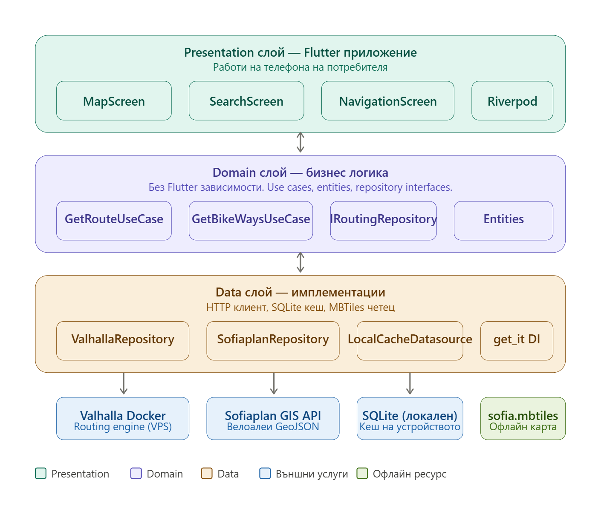
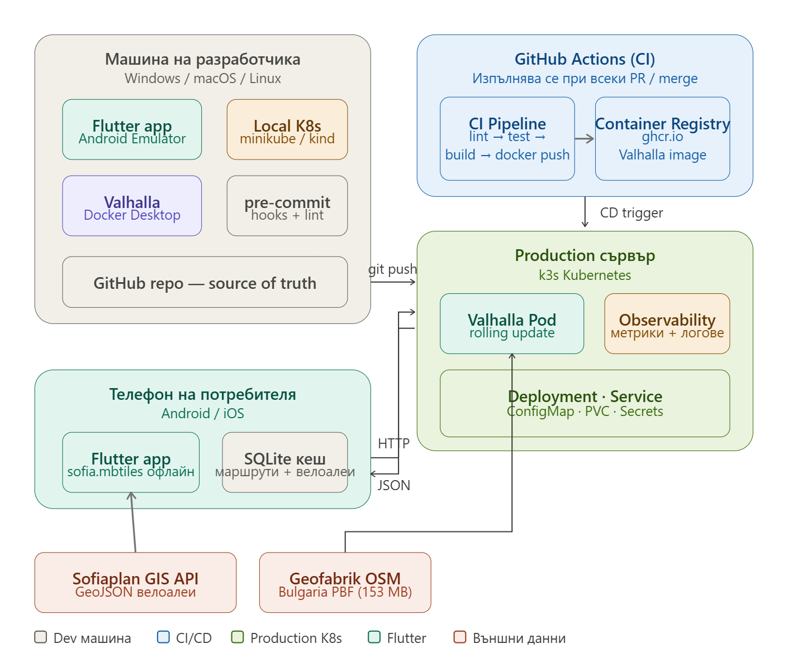
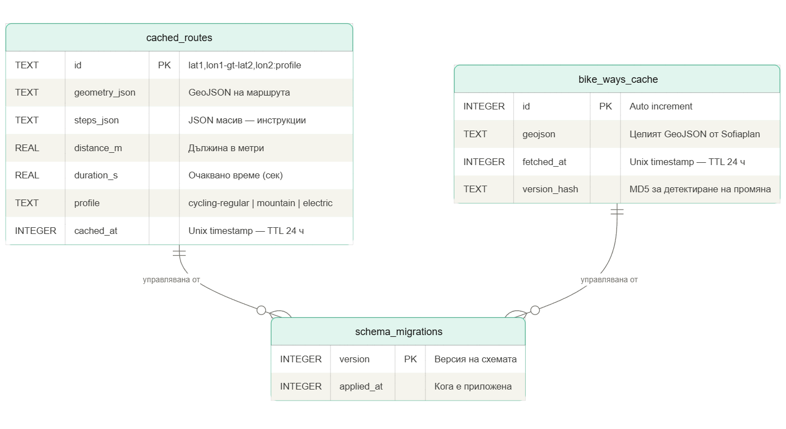
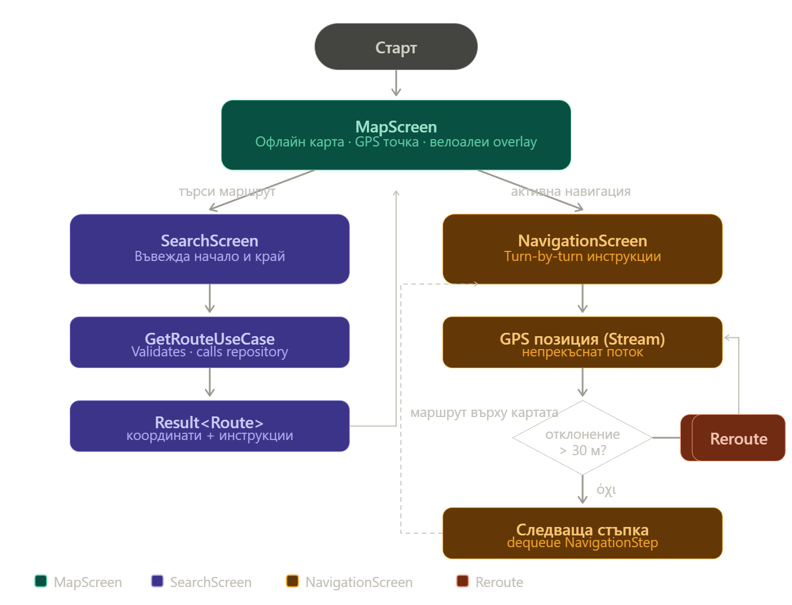
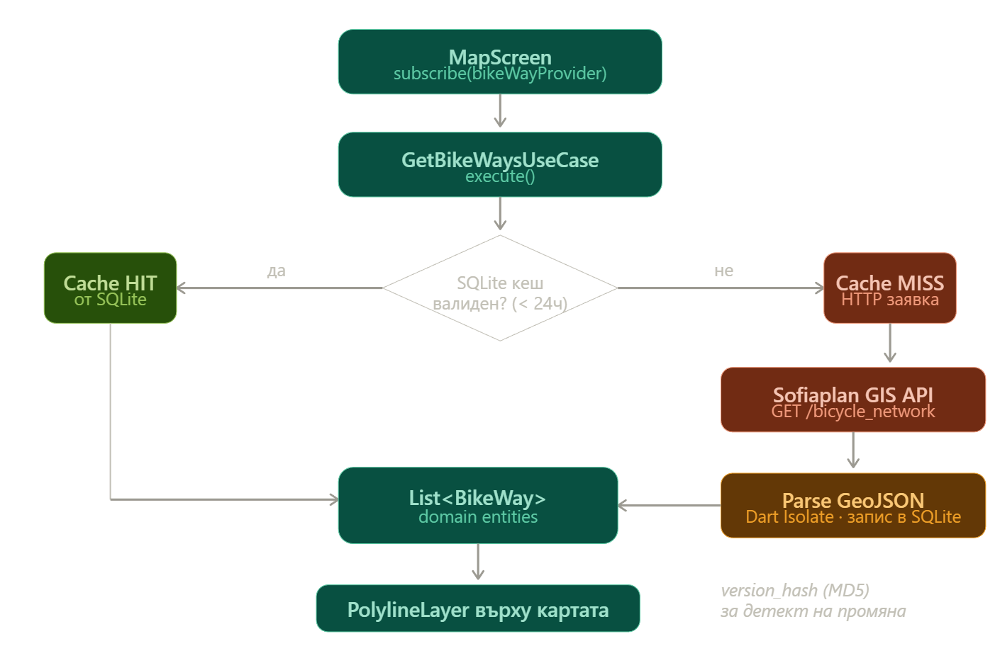
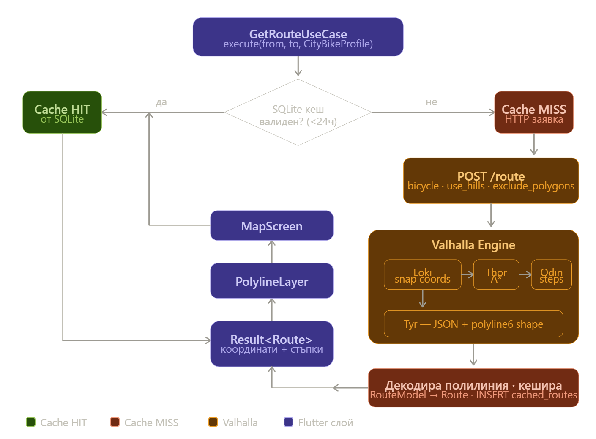

1. Анализ и проучване
   Предметна област и целева аудитория:
   Улесняване на колоездачите, намиране на най-кратък безопасен път.
   Всички колоездачи в София.
   Преглед на минимум 2 съществуващи решения (сравнете негативи/позитиви)
   google maps - няма визуализация на велоалеи и няма навигиране през велоалеи, само кола, пеш и градски.
   waze - както и google maps няма предвид колоездачи.
   Аргументация на избор на технологии
   flutter - добра визуализация на карта. Представянето на тайловете е по-добро и просто от например React Native.
   valhalla - Valhalla превъзхожда всички алтернативни open-source routing engines по ключовите критерии за велосипедно маршрутизиране — динамичен costing модел в реално време, вградена поддръжка на наклони, тайлова архитектура подходяща за мобилни устройства и пълна поддръжка на avoid_polygons за избягване на опасни кръстовища.
   sqllite - избрахме го защото е просто и лесно за локална карта в приложението за за София. Ако в бъдеще ще го правим за по-голяма територия PosGIS на postgre е по-добрият избор.
2. Проектиране
   Функционални изисквания (както са по задание)
   Архитектура на системата
   
   Инфраструктурна диаграма
   
   Схема на БД
   
   UML диаграми
   
   
   
   Ако имате - UI дизайн

3. Реализация
   Файлова структура
   Сървърна част (API endpoints)
   Клиентска част (основни компоненти)
   База данни (модели, заявки)
   Тестване - тестове и покритие
4. Инфраструктура
   Инфраструктурна диаграма
   Docker конфигурация
   CI/CD pipeline
   Инструкции за стартиране на проекта
5. Екранни снимки
6. AI Инструменти
   Claude - reasearch
   Claude code - генериране на бойлерплейтове, дебъгване, писане на документация

7. Заключение - резултат, научено, бъдещо развитие
8. Източници (спазвайки глобален стандарт - пр. APA7; Harvard; etc.)
   github documentation
   flutter dockumentation
   sqlite documentation
   kubernetes dockumentation
   deepwiki
   claude research
9. Приложения (link към хранилищата)
